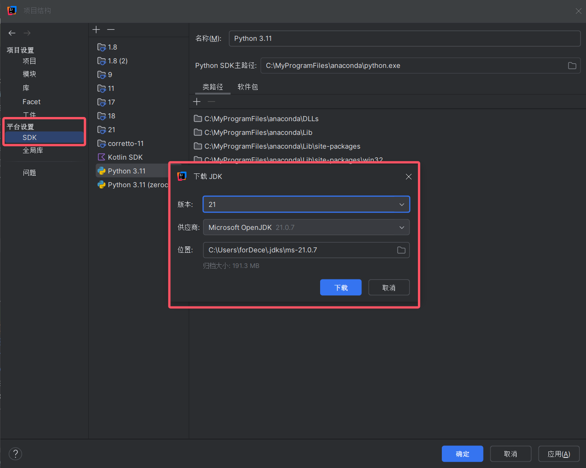
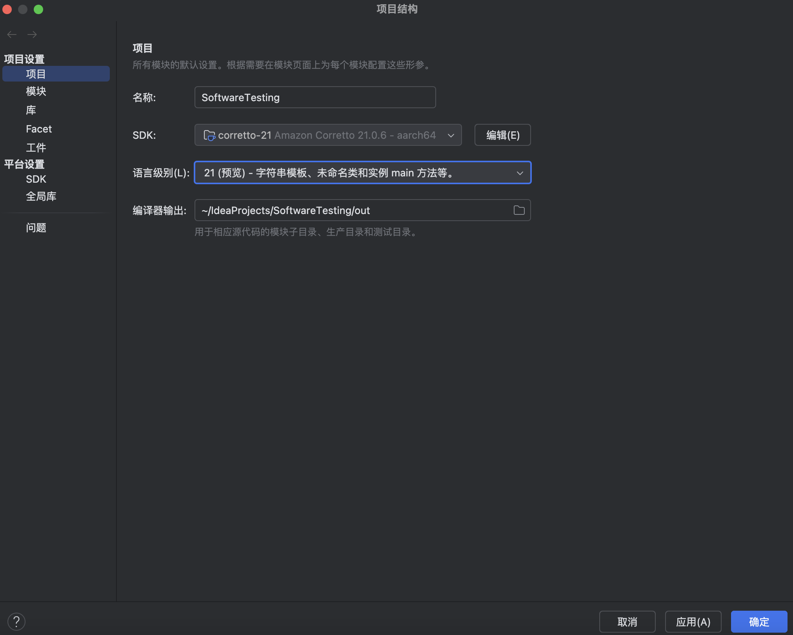
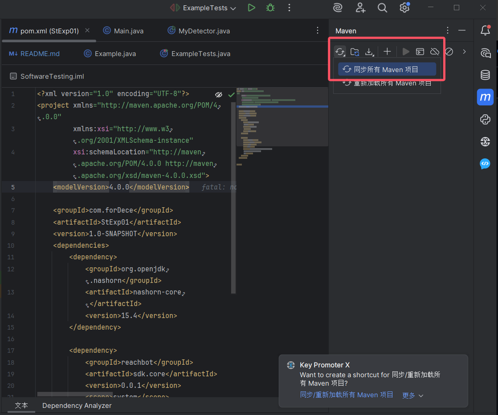
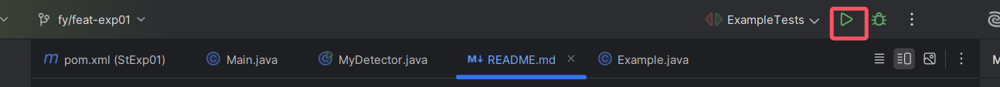
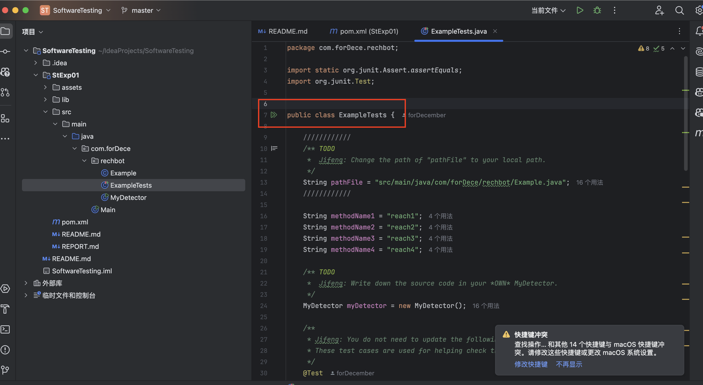
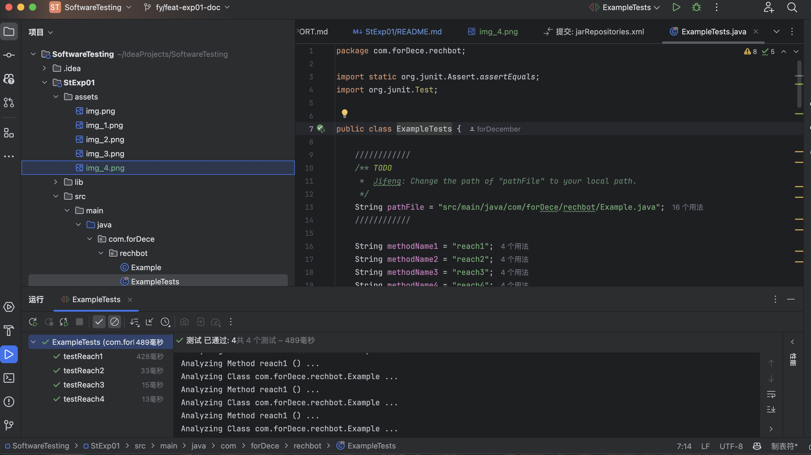

# StExp01

## 使用方式

### 准备 jdk21
- 该项目依赖已通过 maven 管理，使用 jdk21，推荐您用 IDEA 打开
- 一般打开 IDEA 后会提示您指定依赖，按照提示下载并选择 jdk21 即可
- 如果没有提示，您可以在 IDEA 中下载 jdk21 并手动指定
> 右键模块 -> 项目结构 -> SDK -> 选择jdk21并下载 
> 
> 最后指定项目 SDK 为 jdk21
> 
### 刷新 pom 文件、同步 maven 依赖
> 如果您的 jdk 已就绪，需先到 pom 文件同步依赖，也可模块根路径执行 mvn 的相关命令，但推荐使用 IDEA
> 
- 其中`org.openjdk.nashorn`是本人自行添加的依赖，主要用来进行bool表达式运算
- 该依赖 jdk8 内置，jdk8 之后需要单独下载
- 参考：https://tencentcloud.csdn.net/6768f23af3b8a55e4e992f99.html

- reachbot 是老师提供的 jar 包，这里通过本地路径指定

### 启动测试
> 我已将 .idea 文件上传至仓库，如果使用idea，您只需要运行配置项里的 ExampleTests 即可
> 
> 如果没有配置项，您可以在 ExampleTests.java 里点击运行：
> 

### 预期结果
> 本地结果如图，测试全部通过
> 
> 本项目在 mac 中也可顺利运行
> 
> 如您遇到预期之外的结果，请联系本人，本人将迅速解决
