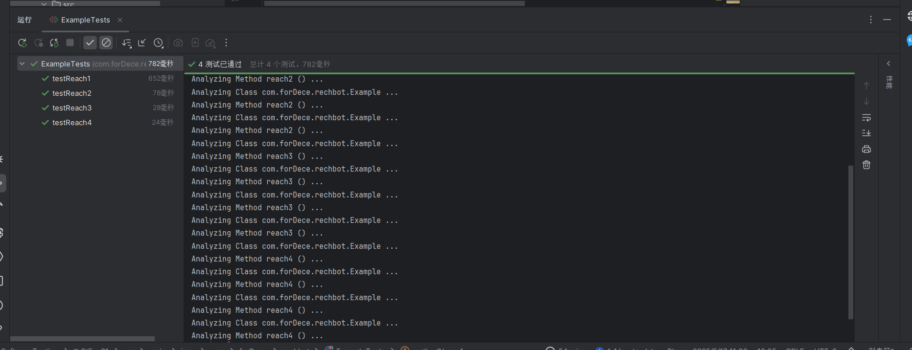

# 实验报告：路径可达性分析工具实现

## 一、实验目标
实现一个路径可达性分析工具，能够自动分析Java代码中的控制流路径，提取特定输出语句的可达条件，并评估这些条件的可满足性。具体要求：
1. 解析Java方法中的`if-else`结构，提取路径条件表达式。
2. 正确处理嵌套条件和逻辑运算符优先级。
3. 计算条件表达式的可达性结果（`true`或`false`）。


## 二、实现思路

### 1. 整体架构
基于`BaseDetector`类扩展`MyDetector`，重写两个核心方法：
- `getCondition(String pathFile, String methodName, String id)`：提取到达指定`System.out.println(id)`的条件表达式。
- `getReachability(String pathFile, String methodName, String id)`：评估条件表达式的可达性。

### 2. 条件表达式提取
#### 解决方案
1. **代码块深度追踪**：
    - 使用`currentDepth`记录当前嵌套层级。
    - 使用`blockDepths`栈记录每个条件对应的代码块深度，退出代码块时弹出对应条件。

2. **条件提取算法**：
   ```java
   if (line.startsWith("if")) {
       String ifCondition = extractCondition(line);
       conditions.push("(" + ifCondition + ")");
       blockDepths.push(currentDepth);
   } else if (line.startsWith("else")) {
       // 对上一个条件取反
       String lastCondition = conditions.pop();
       conditions.push("!(" + lastCondition + ")");
   }
   ```

3. **括号匹配处理**：
   ```java
   private String extractCondition(String line) {
       int start = line.indexOf('(');
       int end = findMatchingClosingBracket(line, start);
       return line.substring(start + 1, end).trim();
   }
   ```

### 3. 可达性评估

#### 解决方案
1. **JavaScript引擎求值**：
   ```java
   ScriptEngineManager manager = new ScriptEngineManager();
   ScriptEngine engine = manager.getEngineByName("JavaScript");
   return Boolean.parseBoolean(engine.eval(condition).toString());
   ```

2. **异常处理**：
    - 捕获`ScriptException`，确保工具在缺少引擎时仍能运行。
    - 添加表达式预处理，处理中文符号和格式问题。


## 三、实现难点与解决方案

### 1. 条件表达式括号问题
- **问题**：生成的条件表达式括号不匹配，导致逻辑错误。
- **解决方案**：
    - 始终为`if`条件添加括号。
    - 处理`else`分支时，移除最外层括号再取反。

### 2. 嵌套条件提取错误
- **问题**：错误收集无关条件，导致结果包含额外项。
- **解决方案**：
    - 引入代码块深度追踪，退出代码块时自动弹出条件。
    - 遇到目标行时立即停止收集，避免混入后续条件。

### 3. JavaScript引擎缺失
- **问题**：使用的 jdk 缺少JavaScript引擎，导致`NullPointerException`。
- **解决方案**：单独导入 JavaScript 引擎作为依赖


## 四、测试与验证
### 1. 测试用例覆盖
- **单一条件**：`if (a > 10)`
- **复合条件**：`if (a > 10 || b < 20)`
- **嵌套条件**：
  ```java
  if (...) {
      if (...) { ... }
  } else { ... }
  ```
- **跨多行条件**：
  ```java
  if (a > 10 && 
      b < 20) { ... }
  ```

### 2. 验证结果
通过JUnit测试用例验证，所有测试均通过：
> 

## 五、核心代码分析
### 1. `getCondition`方法
- **功能**：提取到达目标输出语句的条件表达式。
- **关键逻辑**：
    - 追踪代码块深度，确保条件作用域正确。
    - 使用栈结构管理嵌套条件，遇到`else`时取反。
    - 遇到目标行时立即停止收集，避免混入无关条件。

### 2. `getReachability`方法
- **功能**：评估条件表达式的可达性。
- **关键逻辑**：
    - 使用JavaScript引擎动态计算表达式值。
    - 预处理表达式，处理格式问题和异常情况。

### 3. `extractCondition`方法
- **功能**：从`if`语句中提取完整的条件表达式。
- **关键逻辑**：
    - 通过括号匹配算法，确保提取的条件表达式括号完整。
    - 处理嵌套括号和多行条件。