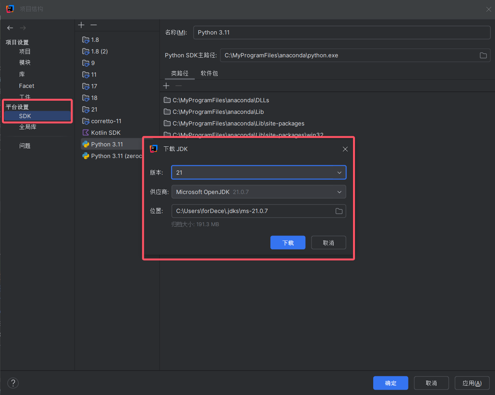
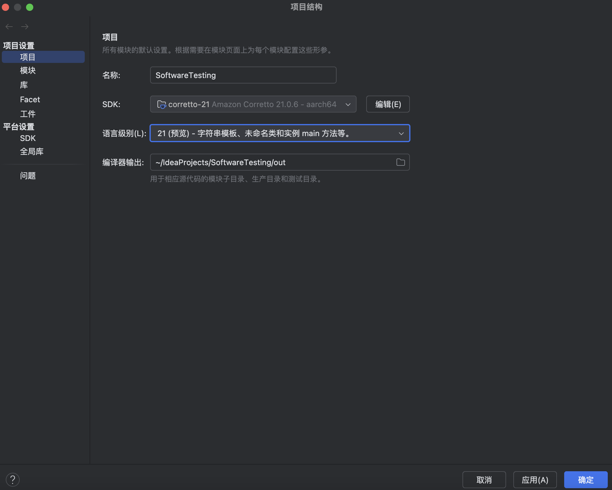
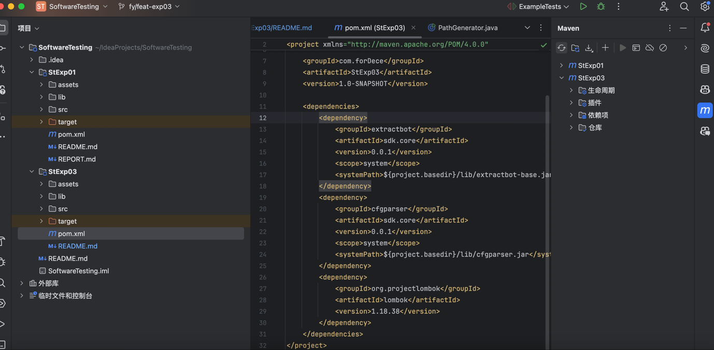
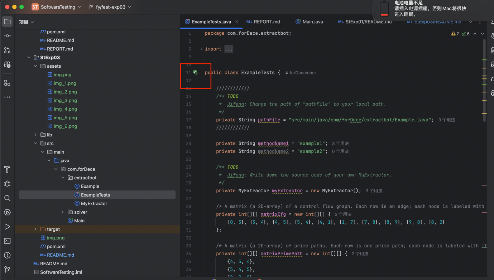
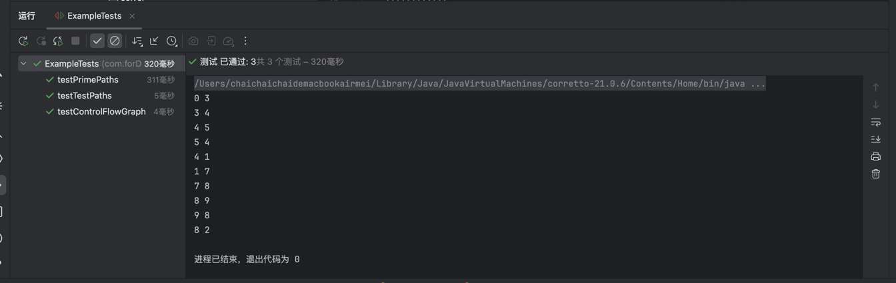
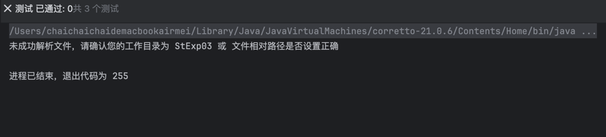

# StExp01

## 使用方式

### 准备 jdk21
- 同第一次实验，本项目依然通过 maven 管理，使用 jdk21，推荐您用 IDEA 打开
- 一般打开 IDEA 后会提示您指定依赖，按照提示下载并选择 jdk21 即可
- 如果没有提示，您可以在 IDEA 中下载 jdk21 并手动指定
> 右键模块 -> 项目结构 -> SDK -> 选择jdk21并下载
> 
> 最后指定项目 SDK 为 jdk21
> 
### 刷新 pom 文件、同步 maven 依赖
> 如果您的 jdk 已就绪，需先到 pom 文件同步依赖，也可模块根路径执行 mvn 的相关命令，但推荐使用 IDEA
> 
- 本次项目除了使用老师提供的两个jar包外（作为本地依赖引入maven），还用了`lombok`
- `lombok`只用到了构建者模式和`setter`的生成器，仅简化代码编写，并不影响整体实现逻辑

### 启动测试
> 同第一次实验，IDEA直接运行所有测试
> 如下图所示
> 

### 预期结果
> 本地结果如图，测试全部通过
> 
> 如您遇到预期之外的结果，请联系本人，本人将迅速解决

## 注意
- 如果您使用`idea`的配置进行测试，请注意将工作目录设置为`StExp03`(项目模块根目录),以免路径出错
- 本人已添加相关提示
> 
> 也可以把`ExampleTests`里的路径设置为绝对路径
